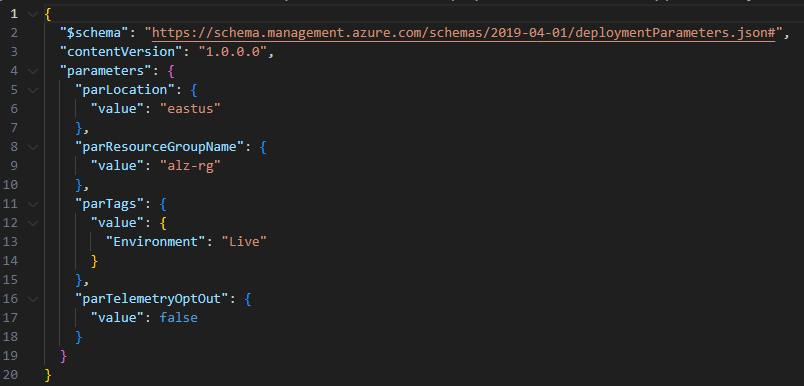
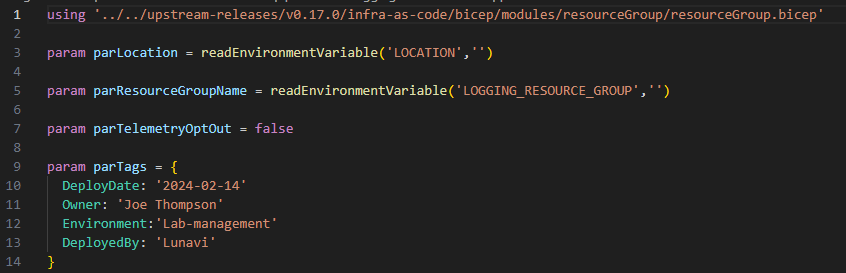
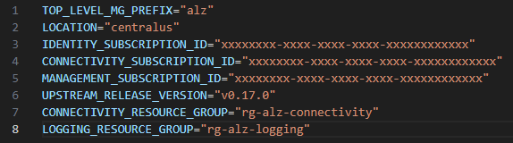
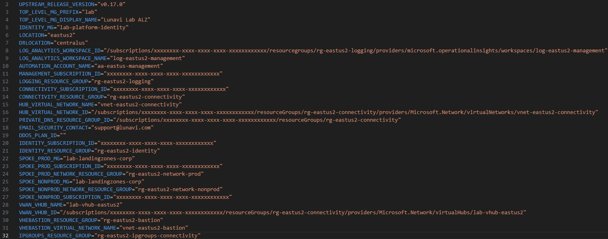
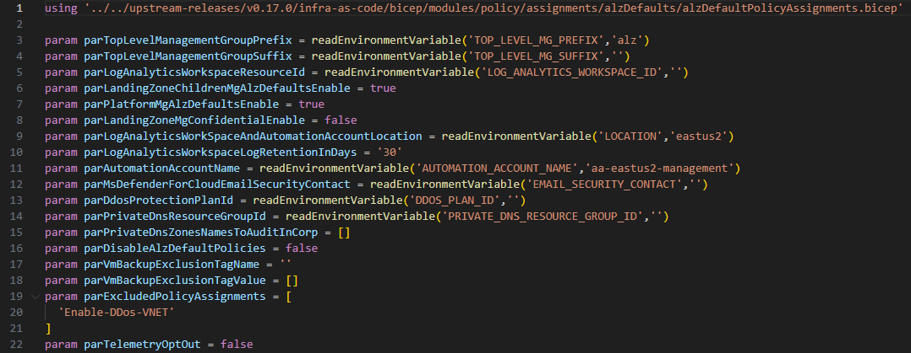
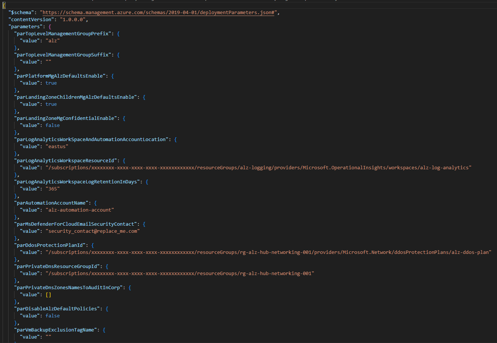
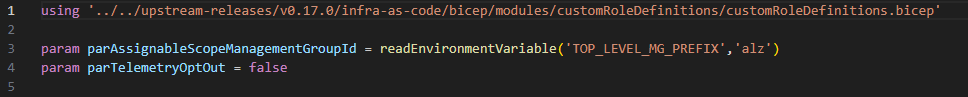
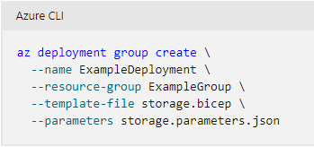

# Utilizing Bicep parameter files with ALZ-Bicep.

The ALZ-Bicep repo on [GitHub](https://github.com/Azure/ALZ-Bicep) provides a proven and repeatable approach to deploying Azure Landing Zones using Azure Bicep Infrastructure as Code (IaC) via either GitHub or Azure DevOps pipelines. If you are unfamiliar with this repo, I encourage you to use it for your Azure Landing Zone deployments.

At Lunavi, we deploy dozens of Azure Landing Zones for customers every year, and that brings up one of the limitations with the pipeline deployments, it uses the Json (JavaScript Object Notation) format for its parameter files. While Bicep is an extension of the ARM (Azure Resource Manager) templates used traditionally to deploy Azure resources, it still uses Json for its parameter files.

Here is an example of a Json parameter file from the ALZ-Bicep GitHub repo.

In the example above, every Json parameter file used for an Azure Landing Zone deployment requires updates to these parameters and more. In the default implementation, this requires modification of up to 11 Json parameter files. When you have customers with different needs, and deployments into different Azure regions, you can see the complexity of having to update 11 Json parameter files with every new Azure Landing Zone.

Beginning with [Bicep v0.18.4](https://learn.microsoft.com/en-us/azure/azure-resource-manager/bicep/parameter-files?tabs=Bicep) and newer, you now have the option to use Bicep files for parameters instead of Json. This opens a whole world of opportunities to streamline your deployments. Now let’s take a look at what you can do with Bicep parameter files.

Taking the example of the Json parameter file above, and converting it to a Bicep template, we can take advantage of additional features available in Bicep files. The ALZ-Bicep deployment pipelines already use a common environment file (.env) to set some global environment variables for use within the pipelines, we will extend to provide additional common parameters we need in our Bicep parameter files.

The **using** statement in the Bicep parameter file ties the Bicep parameter file to a Bicep template, or it can also be associated with an ARM Json template, Bicep modules or template specs. This is also useful later on as you will see.

The next thing you will notice is a parameter being declared and the default value being a Bicep function called [readEnvironmentVariable](https://learn.microsoft.com/en-us/azure/azure-resource-manager/bicep/bicep-functions-parameters-file#readenvironmentvariable). This allows us to declare parameters from environment variables. So, by utilizing the .env environment file mentioned earlier, we can declare all our common parameters in one .env file, instead of multiple Json parameter files as before.

The original environment file, as delivered with the bootstrapped version of ALZ-Bicep has some useful variables already set for use by the deployment pipelines.

But there are many more variables we can set globally. Here is an example from a recent full Azure Landing Zone deployment.

Here is one more example of a Bicep parameter file used to set default policy assignments.

And just for reference, here is what the default policy assignment Json parameter file looks like.

One more example of how simple the parameter files become when using Bicep parameter files, here is the parameter file used to set custom role definitions.

I mentioned the using statement earlier, it helps in other ways too. Previously, when using a Json parameter file, you had to reference both the template file and the parameters file. Now, you only need to reference the parameter file, the reference is inferred with the **using** statement above!

